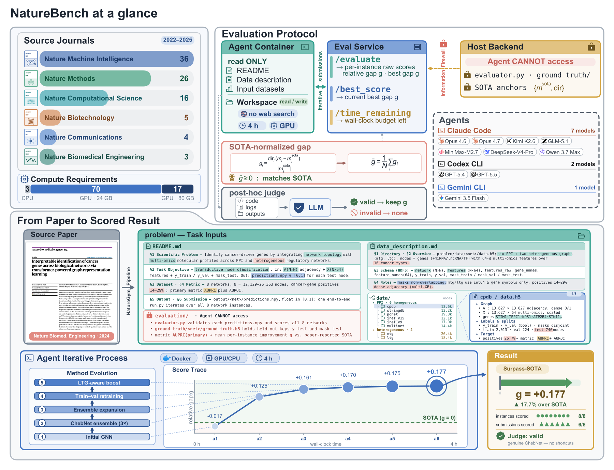
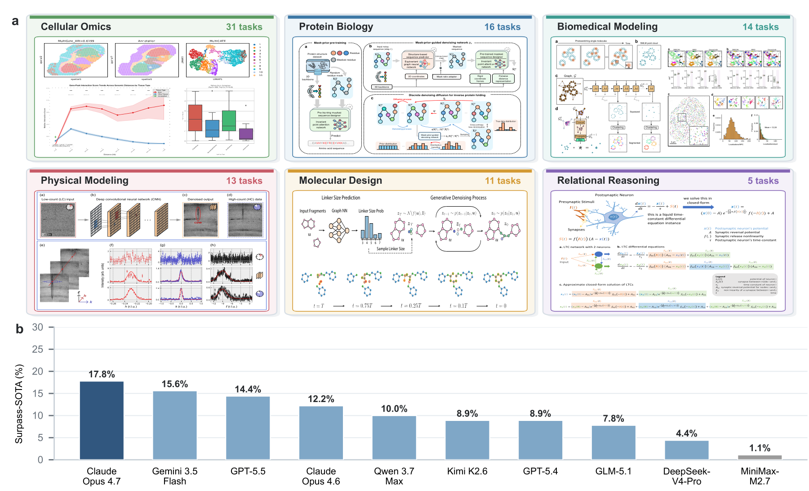

<div align="center">

# NatureBench

**Can coding agents match the published SOTA of Nature-family papers?**

🤗 [Hugging Face Dataset](https://huggingface.co/datasets/FrontisAI/NatureBench) &nbsp;·&nbsp; 🏆 [Leaderboard](https://frontisai.github.io/NatureBench/) &nbsp;·&nbsp; 📜 [License](LICENSE)

</div>

## 📖Overview

NatureBench is a cross-discipline benchmark of **90 tasks** distilled from peer-reviewed Nature-family publications, spanning **6 scientific domains**, designed to evaluate whether AI coding agents can move beyond reproduction toward discovery. Each task asks an agent to solve a real scientific machine-learning problem and is scored against the source paper's reported state of the art.

NatureBench is built on **NatureGym**, an automated pipeline that converts a published paper into a containerized task package comprising a task brief, the paper's dataset, a held-out test set with hidden ground truth, and an automated evaluator.

<p align="center">
  
</p>

## 📊Results

The strongest configuration reaches a 17.8% Surpass-SOTA rate, and success remains uneven across the six scientific domains NatureBench spans.

<p align="center">
  
</p>

## 📦Repository Contents

```text
.
├── LICENSE
├── run_naturebench.py        # one-command entry point: download data and launch evaluation
├── solve.py                  # main evaluation orchestrator
├── eval_service.py           # host-side evaluation service
├── judge.py                  # post-hoc validity judge
├── agent/                    # adapters for Claude Code / Codex CLI / Gemini CLI
├── evaluator/                # evaluator base interface
├── docker/Dockerfile.base    # NatureBench base Docker image
├── scripts/
│   ├── ensure_naturebench_base.sh
│   └── start_eval_services.sh
├── task-set/                 # task lists grouped by resource demand
├── conda_env.yml             # main orchestration environment
├── conda_env_eval.yml        # evaluator service environment
├── eval_env_mapping.json     # task-to-evaluator-service port mapping
└── config.example.yaml
```

## 🔧Installation

```bash
git clone https://github.com/FrontisAI/NatureBench.git
cd NatureBench

conda env create -f conda_env.yml
conda env create -f conda_env_eval.yml
conda activate cnsbench
```

These two `conda env create` commands create two separate environments: `cnsbench` and `cnsbench-eval`.
`cnsbench` is the main orchestration environment used to run `run_naturebench.py`, agent adapters, Docker scheduling, and result aggregation. `cnsbench-eval` is the evaluation service environment used to run scoring logic.

Build the base image:

```bash
bash scripts/ensure_naturebench_base.sh
```

This script checks whether `naturebench-base:v3` already exists locally. If not, it builds the image from `docker/Dockerfile.base`. You can also build it by passing `--ensure-base-image` to `run_naturebench.py`.

## ⚙️Model And Network Configuration

NatureBench starts the agent CLI inside Docker containers. Before running, prepare the corresponding authentication method and network access on the host.

### Claude Code

The public release pipeline uses environment variables for Claude Code. After they are set on the host, `solve.py` passes them into task containers:

```bash
export ANTHROPIC_API_KEY=...
export ANTHROPIC_BASE_URL=...
```

This release does not provide mounting logic for official Claude Code web login state. To use Claude Code, use the API environment variables above or extend the container-side CLI login-state handling yourself.

### Codex

Codex supports two authentication modes.

**device-auth login**

First complete official login once on the host:

```bash
codex login --device-auth
ls ~/.codex/auth.json
```

Use the following runtime parameters:

```bash
--agent codex \
--codex-auth-mode device-auth \
--codex-auth-dir ~/.codex
```

`--codex-auth-dir` defaults to the host `~/.codex`. The pipeline copies `auth.json` (and `config.toml` if present) into a per-task `.codex_state/` and writes new sessions to that task's result directory.

**API-key mode**

```bash
export OPENAI_API_KEY=...
export OPENAI_BASE_URL=...
```

Add this runtime parameter:

```bash
--codex-auth-mode api-key
```

### Gemini CLI

The public release pipeline uses environment variables for Gemini CLI:

```bash
export GEMINI_API_KEY=...
export GOOGLE_GEMINI_BASE_URL=...
```

This release does not provide unified mounting logic for official Gemini CLI login state. To use Gemini CLI, use the API environment variables above or extend the container-side CLI login-state handling yourself.

### Post-hoc Judge

If post-hoc judge is enabled, you can configure a separate judge endpoint. If unset, it falls back to `ANTHROPIC_API_KEY` / `ANTHROPIC_BASE_URL`:

```bash
export JUDGE_API_KEY=...
export JUDGE_BASE_URL=...
```

## 🧪Evaluator Service And Evaluation State

NatureBench agent containers cannot directly access `evaluation/`. Instead, they submit outputs to a host-side evaluator service and receive scores from it. The evaluator service has two modes: external and internal.

**External evaluator service**

This is the recommended mode for formal runs:

```bash
--start-eval-services \
--eval-env-mapping ./eval_env_mapping.json
```

`--start-eval-services` launches independent `eval_service.py` processes per `eval_env_mapping.json`, and `--eval-env-mapping` tells `solve.py` which port each task registers with (in this release all 90 tasks map to the `cnsbench-eval` environment on port `8321`). The service runs independently of `solve.py`, keeps serving later commands, and can use its own conda environment.

It holds per-`(case_id, batch_name)` state in memory — attempt count, best attempt and score, and timers — and appends every `/evaluate` call to the task's `submissions.jsonl`, writing `result.json` and `run_summary.json` when a task finishes. Start the service once and reuse it: later resume commands can reuse the state by dropping `--start-eval-services` while keeping `--eval-env-mapping`. Restarting clears in-memory state (it does not replay `submissions.jsonl`), and to restart, first stop the old process via the PIDs in `eval_logs/eval_service_pids.txt` rather than binding a second service to the same port.

**Internal evaluator service**

This is the fallback when `--eval-env-mapping` is not provided. In this mode, `solve.py` starts a background service inside the current process and uses `--eval-port` for its port. Internal mode is suitable for very small smoke tests or debugging only. It disappears when the current `solve.py` process exits, cannot preserve timers, best scores, or submission history across commands, and requires the main environment itself to satisfy evaluator dependencies. Formal evaluation and resume runs should use external mode.

## 📂Task Package Structure

```text
tasks/
    └── <case_id>/
        ├── problem/
        ├── evaluation/
        ├── environment/
        │   └── Dockerfile.v3
        ├── licenses/
        └── metadata.json
```

Task package fields:

| Field | Description |
|---|---|
| `problem/` | Agent-visible task instructions, input data description, and visible data. |
| `evaluation/` | `evaluator.py` and ground truth; the agent cannot directly access this directory. |
| `environment/Dockerfile.v3` | Task-specific environment, based on the base image defined by `docker/Dockerfile.base`. |
| `metadata.json` | Task name, domain, compute-resource demand, and per-instance SOTA scores. |

## 📋Task Lists

`task-set/` lists are divided only by resource demand:

| File | Tasks | Description |
|---|---:|---|
| `cpu.txt` | 3 | Tasks that do not require a GPU. |
| `gpu_high.txt` | 17 | GPU tasks with higher memory or compute demand. |
| `gpu_low.txt` | 70 | GPU tasks with lower memory or compute demand. |
| `all.txt` | 90 | All tasks. |

## 🚀Run Examples

### Prepare data only

```bash
python run_naturebench.py \
  --dataset-id FrontisAI/NatureBench \
  --tasks all \
  --download-only
```

### CPU Smoke Run

For a first run, start with `cpu` as a smoke test. If the evaluator service has not been started, `--start-eval-services` must be used together with `--eval-env-mapping`; if the service is already running, remove `--start-eval-services` and keep `--eval-env-mapping`.

```bash
python run_naturebench.py \
  --dataset-id FrontisAI/NatureBench \
  --tasks cpu \
  --agent claude \
  --model <model-name> \
  --out-dir ./results/cpu_smoke \
  --start-eval-services \
  --eval-env-mapping ./eval_env_mapping.json \
  --skip-build
```

### Codex Official Login State + Embedded Proxy

This is the recommended launch mode for Codex device-auth. Before running, complete `codex login --device-auth` and prepare `.clash-bundle/`, or specify a bundle with `--proxy-bundle`.

```bash
python run_naturebench.py \
  --dataset-id FrontisAI/NatureBench \
  --tasks gpu_low \
  --agent codex \
  --model <model-name> \
  --gpu-devices 0,1,2,3 \
  --max-workers 4 \
  --start-eval-services \
  --eval-env-mapping ./eval_env_mapping.json \
  --skip-build \
  --codex-auth-mode device-auth \
  --codex-auth-dir ~/.codex \
  --proxy-mode embedded \
  --proxy-bundle ./.clash-bundle
```

### GPU Batch Run

GPU tasks usually require a task set, a GPU list, and a parallelism setting. `--max-workers` is the number of task worker threads and may exceed the currently available number of GPU slots; workers that cannot acquire a GPU wait in the GPU allocator. In the normal GPU pool, each task exclusively occupies one GPU.

```bash
python run_naturebench.py \
  --dataset-id FrontisAI/NatureBench \
  --tasks gpu_low \
  --agent claude \
  --model <model-name> \
  --gpu-devices 0,1,2,3 \
  --max-workers 4 \
  --start-eval-services \
  --eval-env-mapping ./eval_env_mapping.json \
  --ensure-base-image \
  --skip-build
```

### Resume Runs

If some task agents exit before completing the task, use the harness resume mechanism.

Resume continues an existing agent session. The corresponding task directory must preserve the full previous evaluation state, plus the agent's session id and state directory. The running evaluation service must also still hold that task's evaluation state, so do not restart the service before resuming.

Resume only selected tasks:

```bash
python run_naturebench.py \
  --skip-download \
  --data-dir ./data/naturebench_data \
  --tasks gpu_low \
  --agent codex \
  --model <model-name> \
  --out-dir ./results/codex_gpu_low \
  --start-eval-services \
  --eval-env-mapping ./eval_env_mapping.json \
  --codex-auth-mode device-auth \
  --proxy-mode embedded \
  --proxy-bundle ./.clash-bundle \
  --resume-tasks s41592-025-02886-x s42256-024-00892-w \
  --resume-only
```

Without `--resume-only`, the script resumes tasks listed in the resume list and tries to fresh-run other remaining tasks in the same task set. If those other tasks already have prior state and are not listed in `--resume-tasks` or `--force-fresh`, the pipeline errors out to avoid accidental overwrite.

You can also list tasks in a file:

```bash
python run_naturebench.py ... \
  --resume-task-file ./resume_tasks.txt \
  --resume-only
```

## 🎛️Parameter Usage

`run_naturebench.py` is the recommended entry point. It downloads selected tasks and launches evaluation.

### Configuration File

| Parameter | Default | Usage |
|---|---|---|
| `--config` | Automatically uses `./config.yaml` if it exists | Optional YAML config file. Explicit CLI arguments take precedence over config values. |

`config.example.yaml` contains two sections:

| Section | Used By | Purpose |
|---|---|---|
| `run:` | `run_naturebench.py` | Recommended entry-point configuration. |
| `solve:` | `solve.py --config config.yaml` | Used only when calling the low-level evaluator orchestrator directly. |

Usually you only need to edit `run:`. `run_naturebench.py` automatically calls `solve.py`. Maintain `solve:` only if you run `solve.py --config config.yaml` directly.

If you do not want the current directory's `config.yaml` to be read automatically, delete or rename it, or override its settings with explicit CLI arguments.

### Data And Task Selection

| Parameter | Default | Usage |
|---|---|---|
| `--tasks` | `all` | Task selection entry point. Use `all`, `cpu`, `gpu_high`, `gpu_low`, or a custom task-list file. |
| `--dataset-id` | `FrontisAI/NatureBench` | Hugging Face dataset id; usually unchanged. |
| `--dataset-revision` | `None` | Uses the latest version from the HF default branch at download time; usually unchanged. |
| `--data-dir` | `./data/naturebench_data` | Dataset download or local data directory. |
| `--skip-download` | off | Use when data already exists locally; pair with `--data-dir`. |
| `--download-only` | off | Download selected tasks only; does not start evaluator service or agent. |

### Output Directory And Batch

| Case | Final Output Directory | Notes |
|---|---|---|
| Pass `--out-dir ./results/my_run` | `./results/my_run/` | Recommended for formal runs and resume. |
| Omit `--out-dir`, pass `--batch-name my_run` | `./results/my_run/` | `--batch-name` only participates in naming when `--out-dir` is omitted. |
| Omit both | `./results/<agent>_<model>_<tasks>_<timestamp>/` | Automatic timestamped directory; not recommended for later resume. |

Each task's session, workspace, submissions, and results are written under `--out-dir/<case_id>/`. The evaluator service `batch_name` is the final output directory's last path component. For resumable formal runs, fix `--out-dir` or `--batch-name`.

When reusing the same `--out-dir`, tasks with prior state require an explicit choice between `--resume-tasks` and `--force-fresh`; this avoids accidental overwrites.

### Agent And Mode

| Parameter | Default | Usage |
|---|---|---|
| `--agent` | none | Required unless `--download-only` is used. Must be `claude`, `codex`, or `gemini`. |
| `--model` | none | Model name passed to the corresponding CLI. Required unless `--download-only` is used. |
| `--mode` | `base` | Public benchmark protocol uses `base`. `reproduce` additionally mounts paper PDF/Markdown for task calibration. |
| `--timeout` | `14400` | Per-task agent solve budget, in seconds. |
| `--setup-timeout` | `1800` | Container setup-stage cap, in seconds. Setup time does not count toward the agent solve budget. The default `--skip-build` path installs task dependencies during setup. |

### Docker And Task Environment

| Parameter | Default | Usage |
|---|---|---|
| `--skip-build` | on | Default path: do not build a separate image per task. Start from the base image and parse `environment/Dockerfile.v3` during container setup. |
| `--build-task-images` | off | Build a complete Docker image for each task. Slower, but task images can be reused later. `--setup-timeout`. |
| `--ensure-base-image` | off | Check and build `naturebench-base:v3` before running. |
| `--base-image` | `naturebench-base:v3` | Current release default base image. |
| `--dockerfile-name` | `Dockerfile.v3` | Current release default task Dockerfile. |

### Evaluator Service

| Parameter | Default | Usage |
|---|---|---|
| `--start-eval-services` | off | Start the external evaluator service. Use this for the first formal run; usually do not repeat it when the service is already running. |
| `--eval-env-mapping` | none | Task-to-port mapping for external evaluator service. Recommended for formal runs. |
| `--eval-port` | `8321` | Internal evaluator service port; for small debugging runs only. |
| `--eval-log-dir` | `./eval_logs` | External evaluator service log directory. |
| `--skip-judge` | off | Skip post-hoc validity judge. |

### GPU Scheduling

| Scenario | Parameters | Notes |
|---|---|---|
| CPU tasks | no GPU parameters | For `--tasks cpu`. |
| Normal exclusive GPU | `--gpu-devices 0,1,2,3 --max-workers 4` | Each GPU task exclusively occupies one GPU. |
| Cross-process normal GPU pool | add `--gpu-pool-file /tmp/naturebench_gpu_pool.json` | Multiple evaluation processes must share the same pool file to avoid racing for the same GPU. |
| Avoid externally busy GPUs | `--gpu-skip-busy-mb` / `--gpu-skip-busy-util` | Checks memory and utilization before acquiring a GPU; keep defaults on shared machines. |

```bash
--gpu-devices 0,1,2,3 \
--max-workers 4
```

`--max-workers` controls the number of active workers and may exceed the number of available GPUs/slots; workers wait when no GPU is available.

Shared GPU slot pool:

| Parameter | Required | Notes |
|---|---|---|
| `--shared-gpu-task-file` | yes | Lists tasks that use the shared slot pool. |
| `--shared-gpu-device` | yes | Physical GPU used as the shared slot pool. |
| `--shared-gpu-pool-file` | yes | Cross-process state file for shared slots. |
| `--shared-gpu-slots` | no, default `5` | Number of task containers allowed concurrently on the shared GPU; specify explicitly for formal runs. |

When normal and shared tasks are mixed in one `--tasks`, tasks listed in `--shared-gpu-task-file` use the shared pool, while other GPU tasks use the normal `--gpu-devices` exclusive pool:

```bash
--gpu-devices 0,1,2 \
--gpu-pool-file /tmp/naturebench_gpu_pool.json \
--shared-gpu-task-file ./task-set/shared_gpu_tasks.txt \
--shared-gpu-device 3 \
--shared-gpu-slots 5 \
--shared-gpu-pool-file /tmp/naturebench_shared_gpu_pool.json
```

If only shared-pool tasks are run, omit normal `--gpu-devices` and make `--tasks` and `--shared-gpu-task-file` point to the same list. The code allows `--shared-gpu-device` to also appear in normal `--gpu-devices`, but it warns because this double-books the physical GPU; unless you know the resource profile, keep the shared GPU out of the normal pool.

### Network Proxy Parameters

| Mode | Companion Parameters | Usage |
|---|---|---|
| `host` | none required | Pass host `HTTP_PROXY`, `HTTPS_PROXY`, `ALL_PROXY`, `NO_PROXY`, and lowercase variants into containers. The proxy address must be reachable from inside containers. |
| `embedded` | `--proxy-bundle` optional; defaults to `./.clash-bundle` | Start Clash/Mihomo inside each task container and inject container-local `127.0.0.1` proxy variables. |
| `sidecar` | `--proxy-container`, `--proxy-network` required | Use a user-started shared proxy container. |
| `none` | none | Do not inject proxy variables; containers use Docker default networking directly. |

`--proxy-http-port` and `--proxy-socks-port` are used by `embedded` / `sidecar`, defaulting to `7890` and `7891`. Codex defaults to `embedded`; Claude/Gemini default to `host`. Explicit `--proxy-mode` overrides the default.

For `embedded`, provide your own Clash/Mihomo bundle (not included in this repository); `--proxy-bundle` defaults to `./.clash-bundle`:

```text
.clash-bundle/
├── clash                  # executable; can also be a compatible mihomo/clash binary
└── config/
    ├── config.yaml
    └── Country.mmdb       # required if referenced by config.yaml
```

For `sidecar`, start your own proxy container on a shared Docker network and point the pipeline at it:

```bash
docker network create naturebench-net
# Start your clash/mihomo container, exposing 7890/7891 inside the container.

python run_naturebench.py ... \
  --proxy-mode sidecar \
  --proxy-container naturebench-clash \
  --proxy-network naturebench-net
```

### Resume And Force-fresh

| Mode | Use Case | Typical Parameters |
|---|---|---|
| Normal fresh run | First run in an `--out-dir`, or no prior state exists for the task. | no `--resume-*` / `--force-fresh` |
| resume | Continue an existing agent session, preserving task context and evaluator timer history. | `--resume-tasks ...` or `--resume-task-file ...` |
| force-fresh | Start from scratch and archive old state. | `--force-fresh ...` or `--force-fresh-task-file ...` |

| Rule | Behavior |
|---|---|
| Default fresh run | Tasks with no prior state start a new agent session. |
| Fresh meets prior state | If any task already has `result.json`, `submissions.jsonl`, agent session/state, or logs, `solve.py` errors out before any task starts and stops the whole run. |
| Resume eligibility | Requires complete previous task output plus the corresponding agent session and state files. |
| `--resume-only` | Runs only tasks in the resume list; without it, the task set's other tasks are processed too. |
| force-fresh scope | Applies only to tasks that are both in current `--tasks` and listed in `--force-fresh`; there is no `--force-fresh-only`. |
| resume + force-fresh | Can be combined in one command, but not for the same task. Other tasks run fresh. |

### More parameters

```bash
python run_naturebench.py --help
python solve.py --help
```

## 📤Outputs

Each task's result is written under `--out-dir/<case_id>/`:

| File Or Directory | Description |
|---|---|
| `result.json` | Per-task execution metadata such as status, return code, duration, session id, and resume history. |
| `submissions.jsonl` | Every agent `/evaluate` submission, including attempt, raw scores, per-instance improvement, and aggregate improvement. Failed submissions are recorded as well. |
| `judge_verdict.json` | Post-hoc validity judge output, if judge is enabled. |
| `workspace/` | Final agent workspace snapshot. |

Batch-level summary is written to `--out-dir/run_summary.json`. It includes `total_tasks`, `successes` (tasks whose return code is success), `scored_tasks` (tasks whose submissions produced a score), `average_best_aggregate_improvement` (averaged only over scored tasks), total duration, and for each task: `status`, `duration`, `best_attempt`, `best_aggregate_improvement`, `best_raw_scores`, `total_attempts`, and judge results.

## ⚖️License

The top-level [`LICENSE`](LICENSE) applies only to original NatureBench contributions. Third-party data bundled in each task package are governed by the notices in that task's `tasks/<case_id>/licenses/` directory.

## 🎈Citation

If you use NatureBench in your research, please cite our work:

```bibtex
@misc{naturebench2026,
  title        = {NatureBench: Can Coding Agents Match the Published SOTA of Nature-Family Papers?},
  howpublished = {\url{https://github.com/FrontisAI/NatureBench}},
  year         = {2026}
}
```
