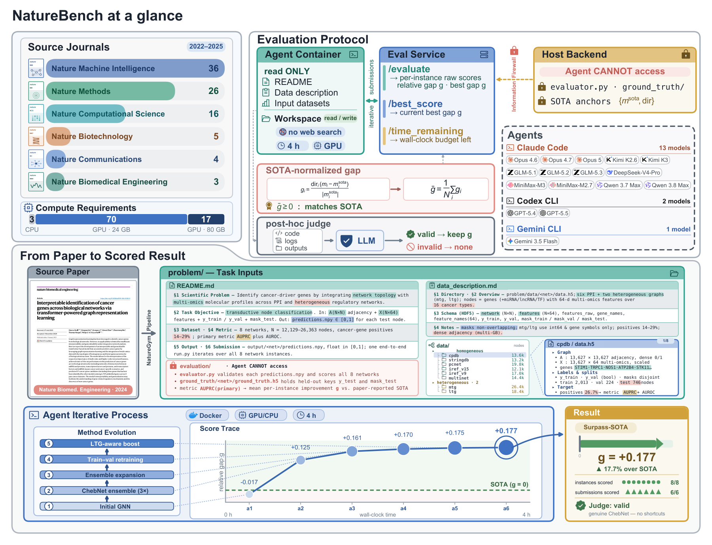
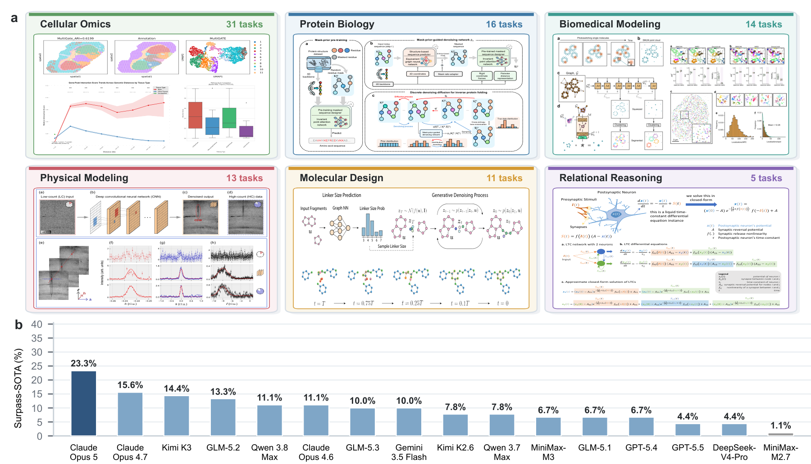

<div align="center">

# NatureBench

**Can coding agents match the published SOTA of Nature-family papers?**

[](https://arxiv.org/abs/2606.24530) &nbsp; [](https://huggingface.co/datasets/FrontisAI/NatureBench) &nbsp; [](https://frontisai.github.io/NatureBench/)

[📰 News](#news) • [📖 Overview](#overview) • [🏅 Submit Results](#submit-results) • [🔧 Setup](#setup) • [🚀 Quick Start](#quick-start)<br>
[⚓ Harbor Support](#harbor-support) • [⚡ NatureBench-25](#naturebench-25) • [🌱 NatureGym](#naturegym) • [📚 Documentation](#documentation) • [⚖️ License](#license) • [🎈 Citation](#citation)

</div>

## 📰News

- **🏆 [2026-09-07] We add the externally submitted Luria 1.0 + DeepSeek-V4-Pro [results](https://frontisai.github.io/NatureBench/#leaderboard).**
- **🏆 [2026-09-07] We update the [results](https://frontisai.github.io/NatureBench/) with Qwen 3.8 Max 0902.**
- **🏆 [2026-09-07] We add the externally submitted HELIX + Claude Opus 5 [results](https://frontisai.github.io/NatureBench/?track=naturebench-25#leaderboard) to the NatureBench-25 leaderboard.**
- **⚓ [2026-08-31] We release the [NatureBench Harbor integration](#harbor-support), including task conversion code, evaluation extensions, and [converted Harbor tasks](https://huggingface.co/datasets/FrontisAI/NatureBench-Harbor).**
- **🏆 [2026-08-30] We update the [results](https://frontisai.github.io/NatureBench/) with GLM-5.3.**
- **⚡ [2026-08-28] We introduce [NatureBench-25](#naturebench-25), a 25-task track for faster, lower-cost evaluation.**
- **🏆 [2026-08-23] We update the [results](https://frontisai.github.io/NatureBench/) with three new coding-agent configurations: Opus 5, Kimi K3, and Qwen 3.8 Max.**
- **🏆 [2026-08-07] We add the externally submitted AIBuildAI 2.5 + Claude Opus 5 [results](https://frontisai.github.io/NatureBench/).**
- **⚖️ [2026-07-30] We update the validity judge and use GPT-5.5 to reassess all runs; the [results](https://frontisai.github.io/NatureBench/) have been comprehensively updated.**
- **🏆 [2026-07-07] We update the [results](https://frontisai.github.io/NatureBench/) with 12 coding-agent configurations, adding GLM-5.2 and MiniMax-M3.**
- **📦 [2026-07-03] We release the full [NatureBench agent traces](https://huggingface.co/datasets/FrontisAI/NatureBench-traces) on Hugging Face.**
- **🚀 [2026-06-24] We introduce [NatureBench](https://arxiv.org/abs/2606.24530), a benchmark for scientific ML coding agents on Nature-family tasks.**

## 📖Overview

NatureBench is a cross-discipline benchmark of **90 tasks** distilled from peer-reviewed Nature-family publications, spanning **6 scientific domains**, designed to evaluate whether AI coding agents can move beyond reproduction toward discovery. Each task asks an agent to solve a real scientific machine-learning problem and is scored against the source paper's reported state of the art.

NatureBench is built on **NatureGym**, an automated pipeline that converts a published paper into a containerized task package comprising a task brief, the paper's dataset, a held-out test set with hidden ground truth, and an automated evaluator.

<p align="center">
  
</p>

## 📊Results

Across sixteen coding-agent configurations, the strongest reaches a 23.3% Surpass-SOTA rate and a 57.8% Match-SOTA rate.

<p align="center">
  
</p>

## 🏅Submit Results

We welcome results from researchers and developers who have evaluated models or
agents on NatureBench. Submissions are currently accepted by email; see
[`submit-results/`](submit-results/) for the result templates, validation and
scoring scripts, required raw artifacts, and submission email.

## 🔧Setup

**Install NatureBench:**

```bash
git clone https://github.com/FrontisAI/NatureBench.git
cd NatureBench

conda env create -f conda_env.yml
conda env create -f conda_env_eval.yml
conda activate naturebench
```

This creates two environments: `naturebench` (the main orchestration environment that runs `run_naturebench.py`, agent adapters, Docker scheduling, and result aggregation) and `naturebench-eval` (the evaluation service environment that runs scoring logic).

**Build the base image manually (optional):**

The base Docker image is built automatically on the first run via `--ensure-base-image` (used in the Quick Start command below). To build it manually:

```bash
bash scripts/ensure_naturebench_base.sh
```

**Start the evaluation service manually (optional):**

The external evaluation service is started automatically via `--start-eval-services` (used in the Quick Start command below). To start it manually:

```bash
bash scripts/start_eval_services.sh ./eval_env_mapping.json
```

If the service was started manually, you must still include `--eval-env-mapping` and point it to the same mapping file when you later run `run_naturebench.py`. Omit `--start-eval-services` because the service is already running.

**Download tasks only (optional):**

Tasks are downloaded automatically by the Quick Start command. To prepare task
packages without starting the evaluation, run:

```bash
python run_naturebench.py \
  --tasks all \
  --download-only
```

Replace `all` with `cpu`, `gpu_low`, or `gpu_high` to download only one compute
group, or pass the path to a custom task-list file containing one task ID per
line. For example, use `--tasks task-set/naturebench-25/all.txt` to download
the complete NatureBench-25 track. By default, tasks are saved under
`./data/naturebench_data/`; use `--data-dir <path>` to choose a different
location. The command also extracts any compressed task data into the
runtime-ready layout.

## 🚀Quick Start

Set credentials for your agent. Claude Code is shown here; for Codex, Gemini CLI, the post-hoc judge, and network proxy, see [`docs/configuration.md`](docs/configuration.md).

```bash
export ANTHROPIC_API_KEY=...
export ANTHROPIC_BASE_URL=...
```

Run end-to-end. This single command downloads the dataset, builds the base image if needed, starts the evaluation service, and evaluates:

```bash
python run_naturebench.py \
  --tasks gpu_low \
  --agent claude \
  --model <model-name> \
  --out-dir ./results/claude_<model-name>_gpu_low \
  --gpu-devices 0,1,2,3 \
  --max-workers 4 \
  --start-eval-services \
  --eval-env-mapping ./eval_env_mapping.json \
  --ensure-base-image
```

This lists only the parameters you set explicitly; options with sensible defaults are omitted (see [Quick Start defaults](docs/usage.md#quick-start-defaults) for the full list and their values). Adjust `--gpu-devices` / `--max-workers` to your hardware. When running without GPUs, omit `--gpu-devices` and any other GPU scheduling options. The complete parameter reference is in [`docs/usage.md`](docs/usage.md).

You can also use a YAML configuration file. The example in [`config.example.yaml`](config.example.yaml) contains the same settings as the command above. Set `<model-name>`, adjust the GPU settings to your hardware, then run:

```bash
cp config.example.yaml config.yaml
python run_naturebench.py
```

The built-in `--agent` options are `claude`, `codex`, and `gemini`; to run your own agent on NatureBench instead, see [`docs/custom-agents.md`](docs/custom-agents.md).

### Evaluation Setup

For comparability, our reported runs use the following setup:

| Setting | Configuration |
|---|---|
| Per-task timeout | A 4-hour agent solve budget (`--timeout 14400`). |
| Compute | Each `gpu_low` task uses one NVIDIA RTX 3090/4090 (24 GB), each `gpu_high` task uses one NVIDIA A800 (80 GB, A100-class), and the 3 `cpu` tasks use no GPU. Task-group lists are provided in [`task-set/`](task-set/). |
| Web search | Disabled for all evaluated agents. |

## ⚓Harbor Support

NatureBench provides a Harbor-compatible way to run the benchmark. We provide
an adapter that converts original NatureBench task packages into Harbor tasks,
the extensions required to run NatureBench evaluation through Harbor, a task downloader, and a reference
configuration. The converted Harbor tasks are distributed in the
[`FrontisAI/NatureBench-Harbor`](https://huggingface.co/datasets/FrontisAI/NatureBench-Harbor) dataset.
See the [Harbor guide](harbor/README.md) for instructions.

## ⚡NatureBench-25

**NatureBench-25** is the 25-task track for faster, lower-cost evaluation. It covers all six scientific domains. Tasks are selected for quality, domain coverage, compute demand, evaluator runtime, and consistency with the Full leaderboard.

It complements rather than replaces the 90-task Full track. Use the Full track for comprehensive benchmark reporting.

The NatureBench-25 task lists are available in `task-set/naturebench-25/` and grouped by compute requirements. To run only this 25-task track, use the Quick Start command above and set `--tasks` to one of the following paths:

| Task list | Counts | Use |
|---|---:|---|
| [`naturebench-25/all.txt`](task-set/naturebench-25/all.txt) | 25 | Complete track |
| [`naturebench-25/cpu.txt`](task-set/naturebench-25/cpu.txt) | 1 | CPU tasks |
| [`naturebench-25/gpu_low.txt`](task-set/naturebench-25/gpu_low.txt) | 22 | Lower-GPU tasks |
| [`naturebench-25/gpu_high.txt`](task-set/naturebench-25/gpu_high.txt) | 2 | Higher-GPU tasks |

## 🌱NatureGym

The task packages are built by **NatureGym**, an automated, Skills-based pipeline that turns a published Nature-family paper into a containerized, runnable task. It filters papers, acquires and verifies the data, and assembles the task package (brief, data, evaluator, environment, metadata), while an information firewall removes the source method so that agents must *discover* solutions rather than reproduce them.

The pipeline runs as a chain of Claude Code skills driven by batch scripts, all under [`naturegym/`](naturegym/). See [`naturegym/README.md`](naturegym/README.md) for the stage-by-stage flow, the construction skills, and how to run them.

## 📦Repository Contents

- `run_naturebench.py` — one-command entry point: download data and launch evaluation
- `solve.py` — main evaluation orchestrator
- `eval_service.py` — host-side evaluation service
- `judge.py` — post-hoc validity judge
- `agent/` — agent adapters and registry for Claude Code / Codex CLI / Gemini CLI (and custom agents)
- `evaluator/` — evaluator interface
- `docker/Dockerfile.base` — NatureBench base Docker image
- `harbor/` — Harbor task adapter, runtime extensions, task downloader, and reference configuration
- `scripts/` — helper scripts
  - `ensure_naturebench_base.sh` — build the NatureBench base image if it is missing
  - `start_eval_services.sh` — start evaluation service from the mapping file
- `task-set/` — Full and NatureBench-25 task lists grouped by resource demand
- `submit-results/` — leaderboard submission guide, templates, and validation/scoring tools
- `docs/` — detailed configuration, usage, task-packages, and custom-agents references
- `naturegym/` — NatureGym construction pipeline: skills + batch drivers that build task packages from papers
- `conda_env.yml` — main orchestration environment
- `conda_env_eval.yml` — evaluation service environment
- `eval_env_mapping.json` — task-to-evaluation-service port mapping
- `config.example.yaml` — example configuration file
- `LICENSE`, `NOTICE` — MIT license for original work; `NOTICE` defines the scope

## 📚Documentation

| Document | Contents |
|---|---|
| [`docs/configuration.md`](docs/configuration.md) | Agent authentication (Claude Code / Codex CLI / Gemini CLI), the post-hoc judge, network proxy, and the evaluation service. |
| [`docs/usage.md`](docs/usage.md) | More run examples (CPU, GPU batch, Codex login, resume), the complete parameter reference, and output formats. |
| [`docs/task-packages.md`](docs/task-packages.md) | Task package structure and the resource-grouped task lists. |
| [`docs/custom-agents.md`](docs/custom-agents.md) | Plugging in a custom agent: How to run your own agent on NatureBench. |
| [Harbor guide](harbor/README.md) | Converting and running NatureBench tasks with Harbor. |
| [`submit-results/`](submit-results/) | Email-submission guide, result templates, validation and scoring tools, and the publication process. |

## ⚖️License

The top-level [`LICENSE`](LICENSE) is the MIT License and applies only to original NatureBench contributions; see [`NOTICE`](NOTICE) for the exact scope. Third-party data bundled in each task package is governed by the notices in that task's `tasks/<case_id>/licenses/` directory.

## 🎈Citation

If you use NatureBench in your research, please cite our work:

```bibtex
@misc{wang2026naturebench,
  title         = {NatureBench: Can Coding Agents Match the Published SOTA of Nature-Family Papers?},
  author        = {Yuru Wang and Lejun Cheng and Yuxin Zuo and Sihang Zeng and Bingxiang He and Che Jiang and Junlin Yang and Yuchong Wang and Kaikai Zhao and Weifeng Huang and Kai Tian and Zhenzhao Yuan and Jincheng Zhong and Weizhi Wang and Ning Ding and Bowen Zhou and Kaiyan Zhang},
  year          = {2026},
  eprint        = {2606.24530},
  archivePrefix = {arXiv},
  primaryClass  = {cs.CL},
  url           = {https://arxiv.org/abs/2606.24530}
}
```
